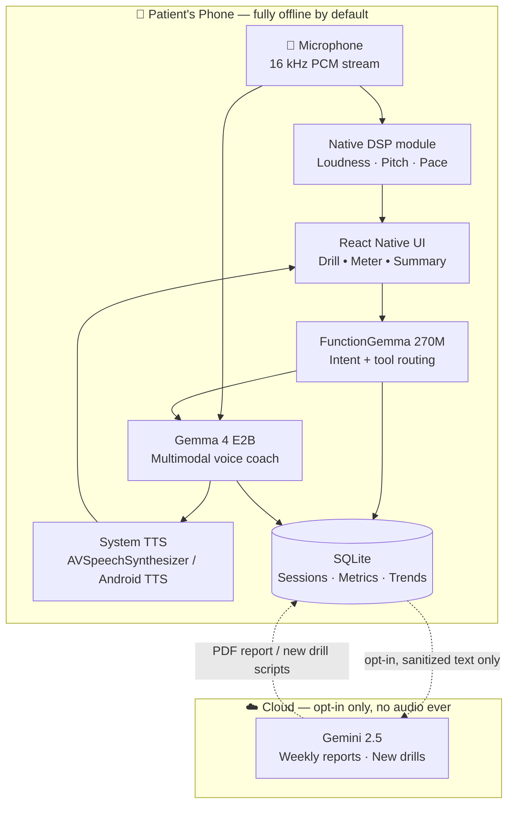
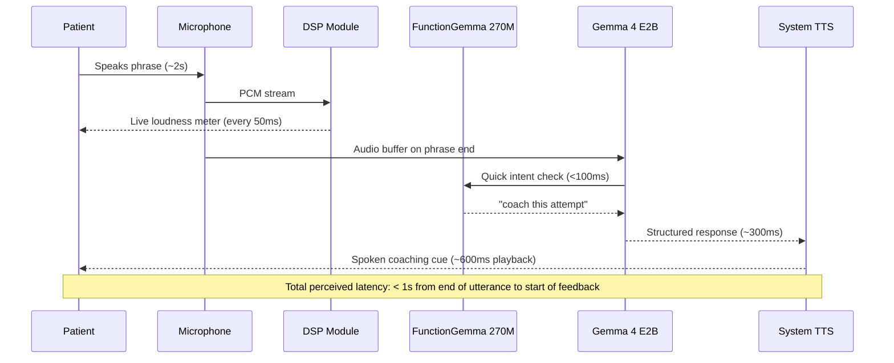

# The Architecture

## Design principles

Every architectural choice in Voice Coach flows from four non-negotiable principles, in this order:

1. **Local first.** Audio never leaves the device by default. Everything required for a complete daily practice session runs offline.
2. **Latency is a feature.** A speech coach that responds in 4 seconds is not a coach. We design for sub-second feedback loops, end to end.
3. **Right tool for each job.** Classical DSP for deterministic acoustic measurements. A small specialist model for routing. A multimodal foundation model for coaching judgment. The cloud only for things that genuinely benefit from it.
4. **Boring where it can be, novel where it must be.** React Native for the shell, SQLite for storage, system TTS for output. We spend our innovation budget where it matters: the on-device multimodal inference loop.

## System at a glance



## The four layers

### Layer 1 — Capture and DSP (the meters)

Raw 16 kHz mono PCM is captured by the OS audio framework (`AVAudioEngine` on iOS, `AudioRecord` on Android) and fed in parallel to two consumers:

- **The DSP module** computes loudness (RMS → dB SPL estimate), fundamental frequency (YIN or autocorrelation pitch tracker), and a rolling syllable-rate estimate every ~50 ms. These power the live UI meters with no model in the loop.
- **A ring buffer** holds the last several seconds of audio for the language model.

This split is deliberate. A loudness bar that updates 20 times per second is a DSP job, not an LLM job. Asking Gemma 4 to do it would burn battery and add latency for no quality gain.

### Layer 2 — Routing (FunctionGemma 270M)

Every drill turn produces a short user utterance. The 270M-parameter FunctionGemma decides what should happen next:

- Was this an attempt at the prompt, a request to repeat, a request to rest, or off-task speech?
- Should the system advance, retry, log a metric, or escalate to the full coach?

FunctionGemma is small, fast (sub-100ms decisions on-device), and purpose-built for structured tool calls. It keeps the heavy Gemma 4 model from being woken up for trivial control-flow decisions.

### Layer 3 — Coaching judgment (Gemma 4 E2B)

When real coaching is needed — when the patient finishes a phrase and deserves feedback — the audio buffer plus the DSP-derived metrics plus the drill context are passed to Gemma 4 E2B running on Cactus.

Gemma 4 receives the audio natively. It reasons over how the patient sounded, not just what they said, and emits a structured response:

```json
{
  "ack": "Good attempt.",
  "feedback": "Your voice trailed off at the end — try again with a steady push of breath.",
  "next_action": "retry",
  "metrics_observed": { "loudness_ok": false, "pitch_range_ok": true, "pace_ok": true }
}
```

The `feedback` string is spoken back through system TTS. The structured fields drive UI state and the SQLite log.

### Layer 4 — Persistence and trend (SQLite + UI charts)

Every drill turn is one row: timestamp, drill type, target loudness, achieved loudness, pitch range, pace, and the model's verdict. Trends are computed locally with simple SQL aggregations and rendered as a 7-day line chart in the session summary.

This local store is the patient's progress record. It is also the only thing that ever gets sanitized and uploaded — and only if the user explicitly opts in to share with their clinician.

## The end-to-end timing budget



## The cloud boundary

The cloud is touched in exactly two places, both opt-in, both text-only:

- **Weekly clinician report.** A summary of the week's metrics (numbers and short text labels — never audio, never raw transcripts) is sent to Gemini, which generates a clean PDF the patient can email to their speech-language pathologist.
- **Personalized drill generation.** When a patient wants new practice content ("phrases about my grandkids," "phrases I use at the pharmacy"), Gemini generates the text. The audio practice itself still happens locally.

Everything else — every microphone sample, every coaching turn, every metric — stays on the device.

## Why this architecture is the right choice

| Property | What the architecture delivers |
| --- | --- |
| **Zero adoption friction** | Patients can use the app from day one with no account, no subscription, and no connectivity. Every barrier that current speech-therapy apps impose is removed by design. |
| **Clinical and enterprise viability** | On-device-by-default sidesteps the HIPAA and GDPR data-processor questions that have kept cloud-based competitors out of clinical recommendation. |
| **Right tool for each job** | The split between DSP, FunctionGemma, and Gemma 4 means each layer does what it is best at — fast meters, fast routing, deep coaching — instead of asking one model to do everything badly. |
| **Full multimodal stack on-device** | Native audio into a multimodal LLM, on-device, with sub-second turn-taking, with a small specialist model gating the large one, and an optional cloud handoff for the narrow set of tasks that genuinely benefit from it. |
