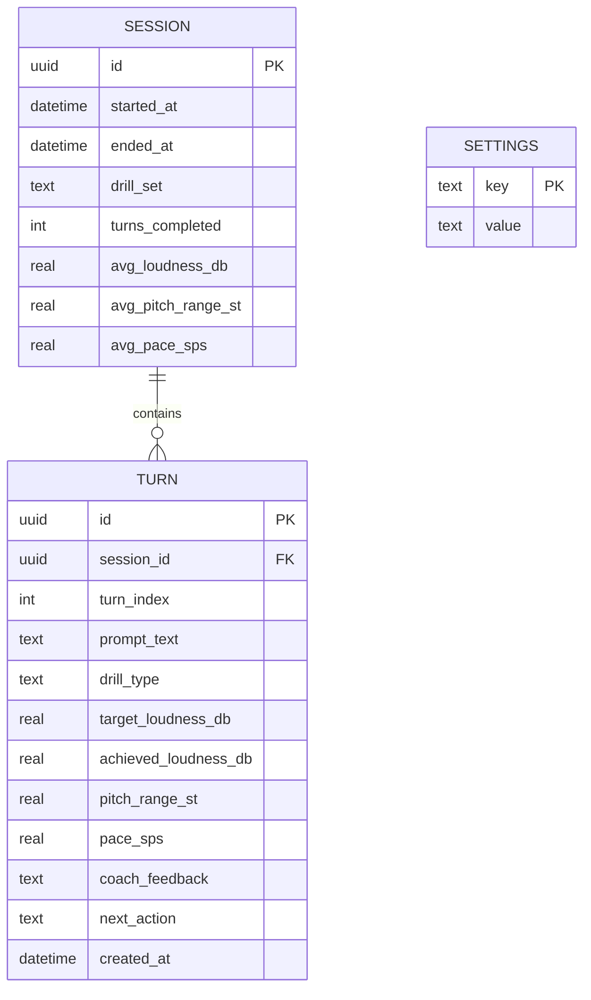
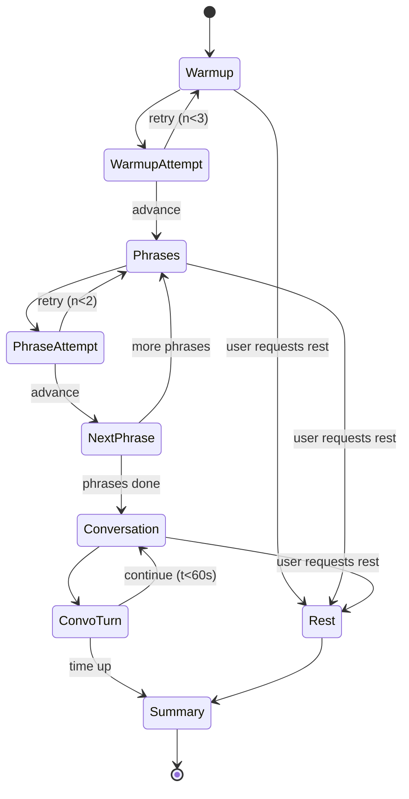

# Implementation Details

This document is the engineering blueprint for the initial MVP. It maps every component of the architecture to a concrete module, a concrete library, an estimated cost, and an owner.

## 1. Repository layout

```
voice-agents-hack-voice-coach/
├── docs/                       ← This documentation set
├── mobile/                     ← React Native 0.85 app (iOS + Android)
│   ├── App.tsx                 ← Navigation root
│   ├── src/
│   │   ├── screens/            ← Home, Drill, Summary, History
│   │   ├── components/         ← LoudnessMeter, PitchMeter, TrendChart
│   │   ├── audio/              ← Native bridge: capture, DSP, ring buffer
│   │   ├── inference/          ← Cactus SDK wrapper, prompt builders
│   │   ├── storage/            ← SQLite schema + repository layer
│   │   ├── drills/             ← Drill content + protocol logic
│   │   └── theme/              ← Accessibility-first design tokens
│   ├── ios/                    ← Cactus xcframework + audio engine
│   └── android/                ← Cactus AAR + AudioRecord bridge
└── assets/                     ← Models (downloaded on first launch), images
```

## 2. Component-to-technology map

| Component | Technology | Notes |
| --- | --- | --- |
| App shell | React Native 0.85, TypeScript 5.8 | Already scaffolded |
| Navigation | `@react-navigation/native` (stack) | Three screens: Home → Drill → Summary |
| Audio capture (iOS) | `AVAudioEngine` via native module | 16 kHz mono PCM, 50 ms frames |
| Audio capture (Android) | `AudioRecord` via native module | Same format for parity |
| DSP — loudness | RMS over 50 ms window → dBFS → calibrated dB SPL estimate | Pure C/Swift/Kotlin, no model |
| DSP — pitch | YIN algorithm, 25 ms hop | Returns F0 in Hz, voicing flag |
| DSP — pace | Energy-based syllable nucleus detector | Rolling syllables/sec |
| On-device router | FunctionGemma 270M via `cactus-react-native` | Structured tool calls |
| On-device coach | Gemma 4 E2B (INT4) via `cactus-react-native` | Native audio input |
| TTS output | `AVSpeechSynthesizer` (iOS) / `TextToSpeech` (Android) | Free, fast, decent quality |
| Local storage | `react-native-quick-sqlite` | Sync, fast, works on Hermes |
| Charts | `victory-native` or `react-native-svg` hand-rolled | Simple 7-day line |
| Cloud (opt-in) | `google-genai` SDK → Gemini 2.5 | Text only, sanitized |
| State | Zustand | Tiny, no boilerplate |
| Logging | `react-native-logs` to a local rolling file | No telemetry sent anywhere |

## 3. Data model (SQLite)



No user table. No account. No PII beyond what the patient types into a free-text "name" field stored locally.

## 4. The inference contract (Gemma 4 prompt schema)

Every coaching turn sends Gemma 4 a small system prompt, the audio buffer, and the DSP-derived numerics. The model is instructed to return strict JSON.

```text
SYSTEM:
You are a warm, patient speech coach for adults with motor speech disorders
(Parkinson's, post-stroke dysarthria). The user just attempted to say:
"<prompt>".
Their target loudness was <target> dB SPL. They reached <achieved> dB SPL.
Their pitch range was <range> semitones. Their pace was <sps> syllables/sec.
You will hear their attempt as audio.

Listen for: vocal effort, breath support, pitch monotony, trailing off,
rushed pace, slurred articulation. Be specific but never discouraging.

Respond with JSON only:
{
  "ack": "<one short warm acknowledgement, 3–6 words>",
  "feedback": "<one specific, actionable cue, 8–18 words>",
  "next_action": "retry" | "advance" | "rest",
  "metrics_observed": {
    "loudness_ok": bool,
    "pitch_range_ok": bool,
    "pace_ok": bool,
    "articulation_ok": bool
  }
}
```

The structured output is what makes the system reliable: the UI advances or retries based on `next_action`, the chart updates from `metrics_observed`, and only `ack + feedback` are spoken.

## 5. Drill protocol (encoded in `src/drills/`)



## 6. Task breakdown (initial MVP)

Tasks are sized so a small team can execute in parallel. **P0** is required for the first usable end-to-end build. **P1** is highly desirable. **P2** is stretch.

| # | Task | Owner track | Priority | Est. time | Depends on |
|---|---|---|---|---|---|
| T01 | Add navigation, theme tokens, screen shells (Home, Drill, Summary, History) | Frontend | P0 | 1.5h | — |
| T02 | Install and configure `cactus-react-native`, run `pod install`, verify import on device | Native | P0 | 2h | — |
| T03 | Download Gemma 4 E2B and FunctionGemma 270M weights, bundle or first-launch download | Native | P0 | 1h | T02 |
| T04 | iOS audio capture native module (`AVAudioEngine` → 16 kHz PCM event stream to JS) | Native | P0 | 3h | — |
| T05 | Android audio capture native module (`AudioRecord` parity) | Native | P1 | 3h | — |
| T06 | DSP module: RMS loudness, dBFS → dB SPL calibration helper | Native | P0 | 2h | T04 |
| T07 | DSP module: YIN pitch tracker, voicing flag, semitone range over window | Native | P1 | 3h | T04 |
| T08 | DSP module: syllable-nucleus pace estimator | Native | P2 | 3h | T04 |
| T09 | `LoudnessMeter` React component (animated bar, target line, accessible) | Frontend | P0 | 1.5h | T06 |
| T10 | `PitchMeter` React component | Frontend | P1 | 1h | T07 |
| T11 | Drill protocol state machine in `src/drills/` (warm-up → phrases → convo → summary) | Frontend | P0 | 2h | T01 |
| T12 | Phrase content set: 20 functional phrases, 8 warm-up vowels, 10 conversation prompts | Content | P0 | 1h | — |
| T13 | Cactus SDK wrapper: load model, pass audio buffer + system prompt, parse JSON response | Inference | P0 | 2h | T02, T03 |
| T14 | Prompt builder: assemble system prompt with drill context and DSP metrics | Inference | P0 | 1h | T13 |
| T15 | TTS playback wrapper (iOS + Android), barge-in handling | Frontend | P0 | 1h | — |
| T16 | SQLite schema migration, repository functions for `session`, `turn`, `settings` | Storage | P0 | 1.5h | — |
| T17 | Wire drill state machine to Cactus calls and SQLite writes | Inference | P0 | 2h | T11, T13, T16 |
| T18 | Session summary screen: 3 numbers + 1 encouragement + 7-day mini-chart | Frontend | P0 | 2h | T16 |
| T19 | History screen: list of past sessions, tap to view detail | Frontend | P1 | 1.5h | T16 |
| T20 | FunctionGemma router for "retry / rest / repeat / done" intents from voice | Inference | P1 | 2h | T13 |
| T21 | Accessibility pass: large text mode, high contrast, hit-target sizes, screen reader labels | Frontend | P0 | 1.5h | T01 |
| T22 | Empty / first-run / model-downloading states with a clear progress UI | Frontend | P0 | 1h | T03 |
| T23 | Cloud (opt-in) weekly PDF report via Gemini — sanitized metrics only | Cloud | P2 | 3h | T16 |
| T24 | Cloud (opt-in) personalized phrase generator via Gemini | Cloud | P2 | 2h | T12 |
| T25 | App icon, splash screen, Home-screen polish | Frontend | P0 | 1h | T01 |

**P0 total: ~26 hours of focused engineering work, parallelizable across two people.**

## 7. Build and run

```bash
git clone <this-repo>
cd voice-agents-hack-voice-coach/mobile
npm install
npx pod-install ios
npm run ios       # or: npm run android
```

The first launch downloads Gemma 4 E2B (~1.6 GB, INT4) and FunctionGemma 270M (~150 MB) and caches them under the app's documents directory. Subsequent launches are instant.

## 8. How to verify the implementation

A reviewer with a build of the app on a physical device can confirm the architectural claims in under a minute:

1. **Local-first.** Put the device in airplane mode, launch the app, and complete a full drill end-to-end. Nothing in the flow requires the network.
2. **DSP, not LLM, in the hot loop.** The loudness meter responds to voice within a single animation frame (~16 ms). This is faster than any LLM round-trip and confirms the metering layer is pure DSP.
3. **Sub-second multimodal turn-taking.** The coach's spoken response begins less than one second after the patient stops speaking, on a recent ARM device. This validates the Gemma 4 + Cactus latency budget.
4. **Structured output, not vibes.** The session summary screen reflects the same numbers stored in the local SQLite database, viewable via the React Native debugger or any SQLite browser pointed at the app's documents directory.

That is the implementation, end to end.
