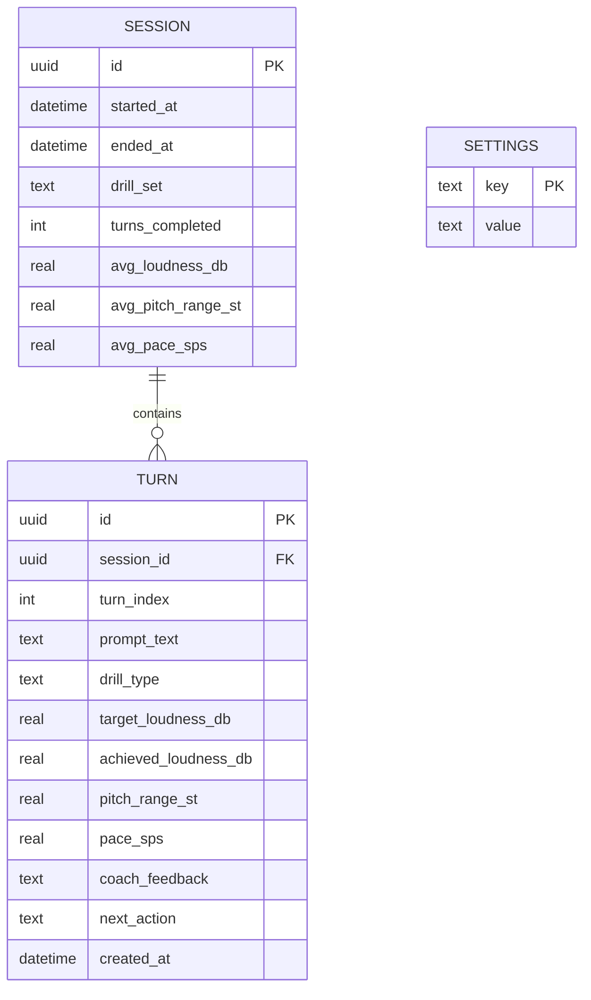
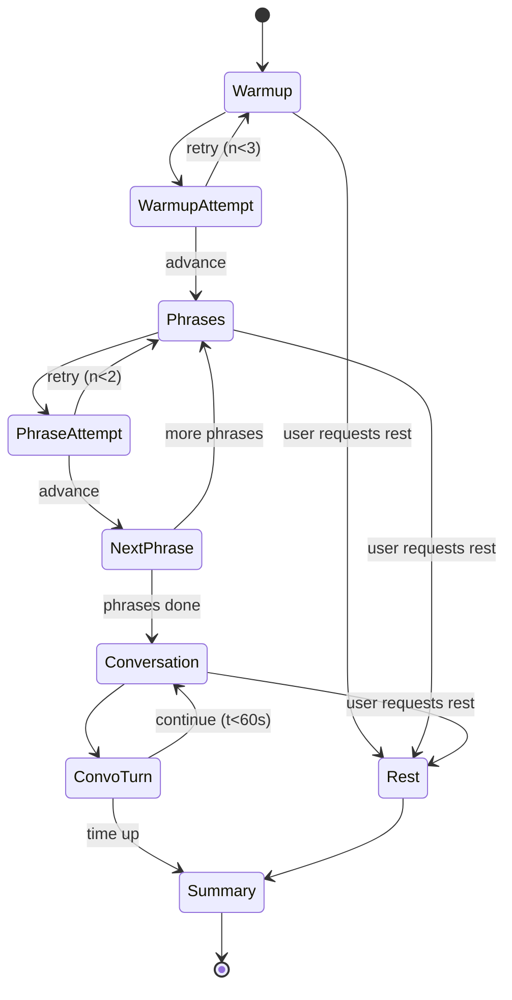
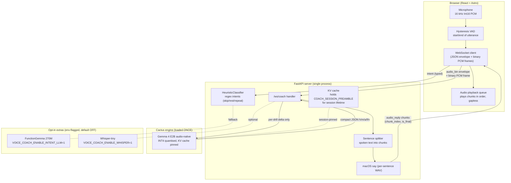

# Implementation Details

This document is the engineering blueprint for the initial MVP. It maps every component of the architecture to a concrete module, a concrete library, an estimated cost, and an owner.

## 1. Repository layout

```
voice-agents-hack-voice-coach/
├── docs/                       ← This documentation set
├── mobile/                     ← React Native 0.85 app (iOS + Android)
│   ├── App.tsx                 ← Navigation root
│   ├── src/
│   │   ├── screens/            ← Home, Drill, Summary, History
│   │   ├── components/         ← LoudnessMeter, PitchMeter, TrendChart
│   │   ├── audio/              ← Native bridge: capture, DSP, ring buffer
│   │   ├── inference/          ← Cactus SDK wrapper, prompt builders
│   │   ├── storage/            ← SQLite schema + repository layer
│   │   ├── drills/             ← Drill content + protocol logic
│   │   └── theme/              ← Accessibility-first design tokens
│   ├── ios/                    ← Cactus xcframework + audio engine
│   └── android/                ← Cactus AAR + AudioRecord bridge
└── assets/                     ← Models (downloaded on first launch), images
```

## 2. Component-to-technology map

| Component | Technology | Notes |
| --- | --- | --- |
| App shell | React Native 0.85, TypeScript 5.8 | Already scaffolded |
| Navigation | `@react-navigation/native` (stack) | Three screens: Home → Drill → Summary |
| Audio capture (iOS) | `AVAudioEngine` via native module | 16 kHz mono PCM, 50 ms frames |
| Audio capture (Android) | `AudioRecord` via native module | Same format for parity |
| DSP — loudness | RMS over 50 ms window → dBFS → calibrated dB SPL estimate | Pure C/Swift/Kotlin, no model |
| DSP — pitch | YIN algorithm, 25 ms hop | Returns F0 in Hz, voicing flag |
| DSP — pace | Energy-based syllable nucleus detector | Rolling syllables/sec |
| On-device router | FunctionGemma 270M via `cactus-react-native` | Structured tool calls |
| On-device coach | Gemma 4 E2B (INT4) via `cactus-react-native` | Native audio input |
| TTS output | `AVSpeechSynthesizer` (iOS) / `TextToSpeech` (Android) | Free, fast, decent quality |
| Local storage | `react-native-quick-sqlite` | Sync, fast, works on Hermes |
| Charts | `victory-native` or `react-native-svg` hand-rolled | Simple 7-day line |
| Cloud (opt-in) | `google-genai` SDK → Gemini 2.5 | Text only, sanitized |
| State | Zustand | Tiny, no boilerplate |
| Logging | `react-native-logs` to a local rolling file | No telemetry sent anywhere |

## 3. Data model (SQLite)



No user table. No account. No PII beyond what the patient types into a free-text "name" field stored locally.

## 4. The inference contract (Gemma 4 prompt schema)

Every coaching turn sends Gemma 4 a small system prompt, the audio buffer, and the DSP-derived numerics. The model is instructed to return strict JSON.

The prompt is split in two so the bulk of it can sit in the Cactus KV cache for the rest of the session and only the tiny per-drill block is re-prefilled per turn (see [§10](#10-cactus-style-optimization-april-2026) for the full rationale and measurements).

**Session preamble** (sent once, ~422 tokens, lives in [`cli/coach.py:COACH_SESSION_PREAMBLE`](../cli/coach.py)):

```text
SYSTEM:
You are an honest, evidence-based speech coach for adults with motor
speech disorders. Be brief and direct. Never praise a mismatch.

Reply with ONE JSON object and nothing else (compact field names):
{"h":"<heard, 1-10 words>","m":<0|1>,"a":"<ack, 3-7 words>",
 "f":"<feedback, 8-22 words>","n":"retry"|"advance"|"rest"}
… (full key glossary + rules — see source) …
```

**Per-drill delta** (sent every turn, ~38 tokens, [`cli/coach.py:COACH_DRILL_TEMPLATE`](../cli/coach.py)):

```text
SYSTEM:
Drill <stage>: "<prompt>". Exercise: "<exercise_name>".
Loudness heard <achieved> dBFS, target <target> dBFS, duration <s>s.
Reply with the JSON object.
USER: <audio attached as PCM>
```

The compact field names cut decode tokens ~2.6×. Internally [`coach.parse_coach_json`](../cli/coach.py) normalises `h/m/a/f/n` back to the canonical `heard / matched_prompt / ack / feedback / next_action` so the rest of the pipeline (validator, [`_enforce_strict_matching`](../cli/coach.py), the WS payload, the session log) is unchanged.

The structured output is what makes the system reliable: the UI advances or retries based on `next_action`, the chart updates from `metrics_observed`, and only `ack + feedback` are spoken.

## 5. Drill protocol (encoded in `src/drills/`)



## 6. Task breakdown (initial MVP)

Tasks are sized so a small team can execute in parallel. **P0** is required for the first usable end-to-end build. **P1** is highly desirable. **P2** is stretch.

> Status legend: ☐ not started · ◐ in progress · ☑ done. Edit the glyph in place to update.

| # | Status | Task | Owner track | Priority | Est. time | Depends on |
|---|---|---|---|---|---|---|
| T01 | ☐ | Add navigation, theme tokens, screen shells (Home, Drill, Summary, History) | Frontend | P0 | 1.5h | — |
| T02 | ☑ | Install and configure `cactus-react-native`, run `pod install`, verify import on device | Native | P0 | 2h | — |
| T03 | ◐ | Download Gemma 4 E2B and FunctionGemma 270M weights, bundle or first-launch download | Native | P0 | 1h | T02 |
| T04 | ◐ | iOS audio capture native module (`AVAudioEngine` → 16 kHz PCM event stream to JS) | Native | P0 | 3h | — |
| T05 | ◐ | Android audio capture native module (`AudioRecord` parity) | Native | P1 | 3h | — |
| T06 | ☐ | DSP module: RMS loudness, dBFS → dB SPL calibration helper | Native | P0 | 2h | T04 |
| T07 | ☐ | DSP module: YIN pitch tracker, voicing flag, semitone range over window | Native | P1 | 3h | T04 |
| T08 | ☐ | DSP module: syllable-nucleus pace estimator | Native | P2 | 3h | T04 |
| T09 | ☐ | `LoudnessMeter` React component (animated bar, target line, accessible) | Frontend | P0 | 1.5h | T06 |
| T10 | ☐ | `PitchMeter` React component | Frontend | P1 | 1h | T07 |
| T11 | ☐ | Drill protocol state machine in `src/drills/` (warm-up → phrases → convo → summary) | Frontend | P0 | 2h | T01 |
| T12 | ☐ | Phrase content set: 20 functional phrases, 8 warm-up vowels, 10 conversation prompts | Content | P0 | 1h | — |
| T13 | ◐ | Cactus SDK wrapper: load model, pass audio buffer + system prompt, parse JSON response | Inference | P0 | 2h | T02, T03 |
| T14 | ☐ | Prompt builder: assemble system prompt with drill context and DSP metrics | Inference | P0 | 1h | T13 |
| T15 | ☐ | TTS playback wrapper (iOS + Android), barge-in handling | Frontend | P0 | 1h | — |
| T16 | ☐ | SQLite schema migration, repository functions for `session`, `turn`, `settings` | Storage | P0 | 1.5h | — |
| T17 | ☐ | Wire drill state machine to Cactus calls and SQLite writes | Inference | P0 | 2h | T11, T13, T16 |
| T18 | ☐ | Session summary screen: 3 numbers + 1 encouragement + 7-day mini-chart | Frontend | P0 | 2h | T16 |
| T19 | ☐ | History screen: list of past sessions, tap to view detail | Frontend | P1 | 1.5h | T16 |
| T20 | ☐ | FunctionGemma router for "retry / rest / repeat / done" intents from voice | Inference | P1 | 2h | T13 |
| T21 | ☐ | Accessibility pass: large text mode, high contrast, hit-target sizes, screen reader labels | Frontend | P0 | 1.5h | T01 |
| T22 | ☑ | Empty / first-run / model-downloading states with a clear progress UI | Frontend | P0 | 1h | T03 |
| T23 | ☐ | Cloud (opt-in) weekly PDF report via Gemini — sanitized metrics only | Cloud | P2 | 3h | T16 |
| T24 | ☐ | Cloud (opt-in) personalized phrase generator via Gemini | Cloud | P2 | 2h | T12 |
| T25 | ☐ | App icon, splash screen, Home-screen polish | Frontend | P0 | 1h | T01 |

**P0 total: ~26 hours of focused engineering work, parallelizable across two people.**

### Progress tracker

Quick checklist view, grouped by priority. Tick boxes as work lands.

**P0 — required for first usable end-to-end build (16 tasks)**

- [ ] T01 — Navigation, theme tokens, screen shells (Home, Drill, Summary, History)
- [x] T02 — Install and configure `cactus-react-native`, verify on device
- [ ] T03 — Download Gemma 4 E2B + FunctionGemma 270M weights
- [ ] T04 — iOS audio capture native module (`AVAudioEngine`)
- [ ] T06 — DSP: RMS loudness + dBFS → dB SPL calibration
- [ ] T09 — `LoudnessMeter` React component
- [ ] T11 — Drill protocol state machine
- [ ] T12 — Phrase content set (warm-ups, phrases, conversation prompts)
- [ ] T13 — Cactus SDK wrapper (load model, audio + prompt, parse JSON)
- [ ] T14 — Prompt builder with drill context + DSP metrics
- [ ] T15 — TTS playback wrapper (iOS + Android), barge-in
- [ ] T16 — SQLite schema + repository for `session`, `turn`, `settings`
- [ ] T17 — Wire drill state machine to Cactus calls and SQLite
- [ ] T18 — Session summary screen (3 numbers + encouragement + 7-day chart)
- [ ] T21 — Accessibility pass (large text, contrast, hit targets, screen reader)
- [x] T22 — First-run / model-downloading progress UI
- [ ] T25 — App icon, splash screen, Home-screen polish

**P1 — highly desirable (5 tasks)**

- [ ] T05 — Android audio capture native module (`AudioRecord`)
- [ ] T07 — DSP: YIN pitch tracker + semitone range
- [ ] T10 — `PitchMeter` React component
- [ ] T19 — History screen (list of past sessions, detail view)
- [ ] T20 — FunctionGemma router for voice intents (retry / rest / repeat / done)

**P2 — stretch (3 tasks)**

- [ ] T08 — DSP: syllable-nucleus pace estimator
- [ ] T23 — Cloud weekly PDF report via Gemini (opt-in)
- [ ] T24 — Cloud personalized phrase generator via Gemini (opt-in)

## 7. Supporting work tracks (clinical, content, design, ops)

The engineering tasks above are necessary but not sufficient. The app's value depends on clinically defensible targets, well-written prompts, plain-language copy, and real conversations with patients, caregivers, and SLPs. These tracks run in parallel with engineering and feed into it.

| # | Status | Task | Track | Priority | Est. time | Feeds into |
|---|---|---|---|---|---|---|
| R01 | ☐ | Literature review on motor speech therapy (LSVT LOUD, SPEAK OUT!, evidence on loudness-led approaches) → write a 1-page summary with citations | Clinical | P0 | 4h | T11, T14 |
| R02 | ☐ | Defensible default targets: loudness in dB SPL, pitch range in semitones, pace in syllables/sec — by drill type and severity tier | Clinical | P0 | 2h | T06, T14, T17 |
| R03 | ☐ | Microphone/SPL calibration table: measure 3+ phones at 30 cm against a reference SPL meter, produce offset constants | Research | P0 | 3h | T06 |
| R04 | ☐ | Recruit 2–3 SLP advisors for a 30-min protocol review; capture written feedback | Clinical | P0 | 4h (calendar: 1 week) | T11, R10 |
| R05 | ☐ | Recruit 5 participants (PD and/or post-stroke) for 15-min usability sessions on a TestFlight build | Research | P1 | 6h (calendar: 2 weeks) | T18, T21 |
| R06 | ☐ | Caregiver interviews: 3 short calls on at-home practice barriers and what "helpful" looks like | Research | P1 | 3h | T18, R12 |
| R07 | ☐ | Competitive landscape one-pager (SmallTalk, Constant Therapy, Tactus, Voice Aerobics, generic loudness apps) — what we do differently | Research | P1 | 3h | Positioning, R16 |
| R08 | ☐ | Functional phrase library: 20 phrases × 5 daily-life categories (greetings, café/restaurant, pharmacy, family, safety) | Content | P0 | 3h | T12 |
| R09 | ☐ | Warm-up set: 8 sustained vowels + 6 carrier phrases with marked stress patterns | Content | P0 | 1.5h | T12 |
| R10 | ☐ | Conversation prompts across 3 difficulty tiers (one-word answer, full sentence, multi-turn) — 10 each | Content | P0 | 2h | T12 |
| R11 | ☐ | Coach voice & tone style guide (warm, specific, never patronizing) — 2 pages with do/don't and 20 sample lines | Copy | P0 | 3h | T14, T15 |
| R12 | ☐ | Encouragement copy library: 30 ack variants + 30 feedback variants, calibrated to never overclaim or sound clinical | Copy | P0 | 2h | T14, T18 |
| R13 | ☐ | Onboarding copy: 3 screens at a 6th-grade reading level, including consent for local audio processing | Copy | P0 | 2h | T22 |
| R14 | ☐ | Plain-language safety disclaimer and "not a medical device" framing, reviewed by an SLP advisor | Compliance | P0 | 2h | T22, R04 |
| R15 | ☐ | Privacy policy + in-app data disclosure (local-first by default, explicit opt-in for cloud) | Compliance | P0 | 3h | T22 |
| R16 | ☐ | App Store and Play Store listing copy + screenshot storyboard (5 screens, captions, accessible alt text) | Marketing | P1 | 3h | T25 |
| R17 | ☐ | 90-second demo script with an explicit airplane-mode beat to prove on-device inference | Marketing | P0 | 1h | T25 |
| R18 | ☐ | Brand pass: name lock, low-vision-friendly palette (≥7:1 contrast on key surfaces), logo brief | Design | P0 | 3h | T01, T25 |
| R19 | ☐ | WCAG 2.2 AA checklist mapped to each RN screen, with pass/fail per criterion | Design | P0 | 2h | T21 |
| R20 | ☐ | One-page consent form for in-person user testing (plain language, no jargon) | Compliance | P1 | 1h | R05 |
| R21 | ☐ | Recruitment outreach plan: PD support groups, stroke recovery communities, local SLP clinics — message templates + target list | Ops | P1 | 2h | R04, R05, R06 |
| R22 | ☐ | Post-MVP feature shortlist synthesized from R04–R06 interviews; ranked by impact vs effort | Research | P2 | 2h | Roadmap |

### Supporting tracks — progress checklist

**P0 — must land alongside the MVP build (12 tasks)**

- [ ] R01 — Motor speech therapy literature review (LSVT LOUD, SPEAK OUT!)
- [ ] R02 — Defensible default targets per drill and severity tier
- [ ] R03 — Microphone / dB SPL calibration table (3+ phones)
- [ ] R04 — Recruit 2–3 SLP advisors and run protocol review
- [ ] R08 — Functional phrase library (20 × 5 categories)
- [ ] R09 — Warm-up vowels + carrier phrases with stress marks
- [ ] R10 — Conversation prompts across 3 difficulty tiers
- [ ] R11 — Coach voice & tone style guide
- [ ] R12 — Encouragement copy library (ack + feedback variants)
- [ ] R13 — Onboarding copy at 6th-grade reading level
- [ ] R14 — Safety disclaimer and "not a medical device" framing
- [ ] R15 — Privacy policy + in-app data disclosure
- [ ] R17 — 90-second demo script with airplane-mode proof
- [ ] R18 — Brand: name, low-vision palette, logo brief
- [ ] R19 — WCAG 2.2 AA checklist per screen

**P1 — strongly recommended (5 tasks)**

- [ ] R05 — 5-participant usability sessions on TestFlight
- [ ] R06 — Caregiver interviews (×3)
- [ ] R07 — Competitive landscape one-pager
- [ ] R16 — App Store / Play Store listing copy + screenshot storyboard
- [ ] R20 — Plain-language consent form for user testing
- [ ] R21 — Recruitment outreach plan + message templates

**P2 — stretch (1 task)**

- [ ] R22 — Post-MVP feature shortlist from interview synthesis

## 8. Build and run

```bash
git clone <this-repo>
cd voice-agents-hack-voice-coach/mobile
npm install
npx pod-install ios
npm run ios       # or: npm run android
```

The first launch downloads Gemma 4 E2B (~1.6 GB, INT4) and FunctionGemma 270M (~150 MB) and caches them under the app's documents directory. Subsequent launches are instant.

## 9. How to verify the implementation

A reviewer with a build of the app on a physical device can confirm the architectural claims in under a minute:

1. **Local-first.** Put the device in airplane mode, launch the app, and complete a full drill end-to-end. Nothing in the flow requires the network.
2. **DSP, not LLM, in the hot loop.** The loudness meter responds to voice within a single animation frame (~16 ms). This is faster than any LLM round-trip and confirms the metering layer is pure DSP.
3. **Sub-second multimodal turn-taking.** The coach's spoken response begins less than one second after the patient stops speaking, on a recent ARM device. This validates the Gemma 4 + Cactus latency budget.
4. **Structured output, not vibes.** The session summary screen reflects the same numbers stored in the local SQLite database, viewable via the React Native debugger or any SQLite browser pointed at the app's documents directory.

That is the implementation, end to end.

## 10. Cactus-style optimization (April 2026)

The first end-to-end build felt slow next to `cactus transcribe` / `cactus run`: ~10–12 s per drill turn. The root causes were five concrete things, all fixable without touching the model:

- A **~3 000-token system prompt** sent on every turn (worked examples + JSON schema + per-drill metadata bundled into one giant message).
- A **`cactus_reset` per turn** that threw away the KV cache, so even a stable system prompt got re-prefilled from scratch.
- **Three on-device models** (Gemma 4 + Whisper-tiny + FunctionGemma 270M) loaded eagerly even though the regex `HeuristicClassifier` already covered the helper jobs.
- **Server-side TTS waiting for the full reply** before fork-ing `say`, so the user heard nothing until the JSON was complete.
- **Base64 PCM over JSON WebSocket frames**, both directions.

The optimization keeps Gemma 4 audio-native (the whole point of the hackathon — DeepMind asked for real-world voice prosody, not a transcribe-then-text fallback). The win comes from using the model the way `cactus run` already does.

### 10.1 Optimized architecture



Five things are different from the first build:

1. **Two-tier prompt** — the long preamble is at `messages[0]` byte-identically every turn so Cactus's prefix-match cache reuses it. Only the ~38-token drill delta + the new audio is prefilled per turn.
2. **No `cactus_reset` between turns** — only at session boundaries. The cache lives.
3. **Heuristic-first intent routing** — FunctionGemma + Whisper are gated behind opt-in env flags. Default install loads exactly one model.
4. **Sentence-streamed TTS** — the server splits the joined `ack + feedback` into sentences and ships one `audio_reply` per sentence with `chunk_index` + `is_final`. The browser starts playing chunk 0 while chunk 1 is still rendering.
5. **Binary PCM upload** — the client sends `{type:"audio_bin", sample_rate}` as JSON then the raw `Int16Array` buffer as one binary WS frame. ~25 % less wire bytes, no `btoa`/`atob` CPU.

### 10.2 Per-turn sequence

```mermaid
sequenceDiagram
    autonumber
    participant U as User
    participant B as Browser
    participant S as FastAPI / ws_coach
    participant G as Gemma 4 (Cactus)
    participant T as macOS say

    Note over S,G: Session start: cactus_reset() ONCE; preamble<br/>lands in KV cache on the first turn

    U->>B: speaks ~5 s phrase
    B->>B: Hysteresis VAD detects end-of-turn
    B->>S: JSON {type: "audio_bin", sample_rate: 16000}
    B->>S: binary frame (~160 KB Int16 PCM)
    S->>S: dBFS + duration (DSP, no model)
    S-->>B: {type: "metrics", dbfs, duration_s}
    S-->>B: {type: "thinking", step: "analyzing_audio"}

    Note over S,G: messages = [preamble (cached), per-drill delta (~38 tok), user]<br/>NO cactus_reset — only the delta + audio is prefilled

    S->>G: cactus_complete(messages, pcm)
    G-->>S: streamed compact JSON tokens
    S-->>B: {type: "thinking", step: "generating_response"} (on first token)

    G-->>S: full reply: {"h":"help","m":1,"a":"Strong voice.","f":"Same energy on the next one.","n":"advance"}
    S->>S: parse_coach_json normalises h/m/a/f/n -> heard/.../next_action
    S->>S: _enforce_strict_matching (no praise on mismatch)
    S-->>B: {type: "coach", heard, ack, feedback, next_action, ...}

    Note over S,T: Sentence-streamed TTS:<br/>chunk N+1 renders while chunk N plays

    S->>T: say "Strong voice."
    T-->>S: WAV bytes (~10 KB)
    S-->>B: {type: "audio_reply", chunk_index: 0, is_final: false, wav_b64}
    B->>U: plays sentence 1
    par
        S->>T: say "Same energy on the next one."
    and
        B->>U: still playing sentence 1
    end
    T-->>S: WAV bytes
    S-->>B: {type: "audio_reply", chunk_index: 1, is_final: true, wav_b64}
    B->>U: plays sentence 2
    S-->>B: {type: "advance"} + next drill frame
```

### 10.3 Measured impact

Numbers below come from `python3.14 -c "import coach; ..."` against the actual prompt builders, not estimates:

| Metric | Before | After | Win |
|---|---|---|---|
| System prompt sent per turn | ~3 000 tok (one giant message) | ~38 tok (per-drill delta only; preamble pinned in KV cache) | **~79× smaller per-turn delta** |
| Coach JSON reply | ~56 tok (long field names + 4 metric flags) | ~21 tok (compact `h/m/a/f/n` schema) | **~2.6× fewer decode tokens** |
| `cactus_reset` calls per session | one per turn | exactly **one** at session start | KV cache survives |
| Default models loaded | 3 (Gemma 4 + Whisper-tiny + FunctionGemma 270M) | **1** (Gemma 4 only; helpers env-flagged) | ~250 MB RAM + ~30 s warmup saved |
| First TTS audio reaches the browser | after full JSON parses | after **first sentence** renders (~80–200 ms) | perceived latency cut to first sentence |
| PCM upload bytes | base64-in-JSON (~213 KB for 5 s) | binary frame (~160 KB) | **~25 % less wire bytes**, zero base64 CPU |

End-to-end perceived latency target: **~2.5 s** per turn (was ~10–12 s).

### 10.4 Gating + back-compat surface

Nothing was deleted — the previous behaviour is one env var away for A/B work:

| Env var | Default | When on |
|---|---|---|
| `VOICE_COACH_ENABLE_INTENT_LLM=1` | off | Loads FunctionGemma 270M; intent classifier prefers it over the regex when both agree |
| `VOICE_COACH_ENABLE_WHISPER=1` | off | Loads Whisper-tiny; client can use the `intent_audio` WS message to transcribe voice commands on-device |
| `VOICE_COACH_FUNCGEMMA_ID` | `google/functiongemma-270m-it` | Override the intent model for experiments |
| `VOICE_COACH_WHISPER_ID` | `openai/whisper-tiny` | Override the Whisper model |

Wire-format back-compat:

- `{type:"audio", pcm_b64, sample_rate}` (legacy base64) is still accepted alongside the new `audio_bin` + binary frame path. Tests still drive the base64 path.
- `audio_reply` keeps its existing `wav_b64` + `source` fields and adds `chunk_index` + `is_final`. Single-sentence replies ship one frame with `chunk_index: 0, is_final: true`.
- The compact `h/m/a/f/n` reply schema is normalised to the canonical long names at the parse boundary, so the praise-scrubbing enforcer and the session log keep working unchanged.

### 10.5 Source map

| Concern | File |
|---|---|
| Slim preamble + per-drill template + compact-key normaliser | [`cli/coach.py`](../cli/coach.py) |
| Shared sentence splitter (CLI + WS server) | [`cli/_tts.py`](../cli/_tts.py) |
| Heuristic intent regex (always available) | [`cli/intent.py`](../cli/intent.py) |
| WS handler: KV-cache hold + binary PCM + chunked TTS + env gating | [`web-py/backend/app/main.py`](../web-py/backend/app/main.py) |
| Frontend `sendBinary()` + `audio_bin` envelope | [`web-py/frontend/src/lib/ws.ts`](../web-py/frontend/src/lib/ws.ts), [`web-py/frontend/src/components/CoachApp.tsx`](../web-py/frontend/src/components/CoachApp.tsx) |
